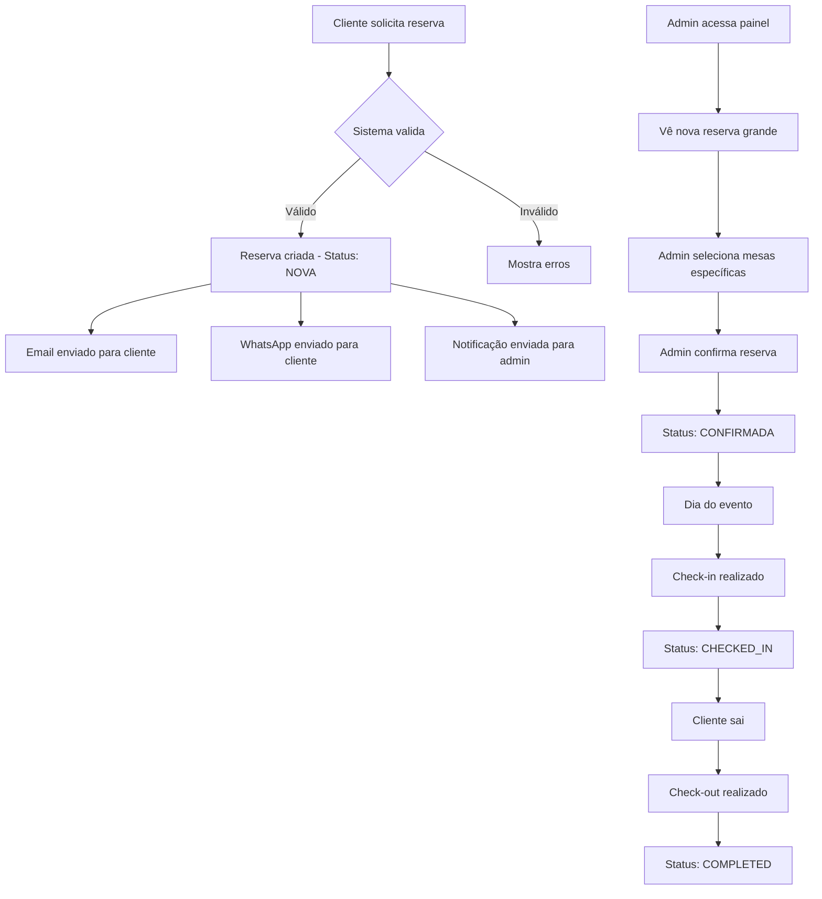

# 🎉 Sistema de Reservas Grandes - Implementação Completa

## ✅ Funcionalidades Implementadas

### 1. **Banco de Dados**
- ✅ Tabela `large_reservations` criada com todos os campos necessários
- ✅ Suporte a reservas acima de 15 pessoas
- ✅ Campos para mesas selecionadas pelo admin (JSON)
- ✅ Controle de origem (CLIENTE/ADMIN)
- ✅ Flags de notificações enviadas (email/WhatsApp)

### 2. **Backend API**
- ✅ Endpoint completo `/api/large-reservations` com CRUD
- ✅ Validação específica para reservas grandes (mínimo 16 pessoas)
- ✅ Integração com sistema de áreas e mesas existente
- ✅ Sistema de notificações automáticas
- ✅ Suporte a seleção de mesas específicas pelo admin

### 3. **Frontend Admin**
- ✅ Nova aba "Reservas Grandes" no painel administrativo
- ✅ Modal completo para criar/editar reservas grandes
- ✅ Interface para seleção de mesas específicas pelo admin
- ✅ Controle de status (Nova → Confirmada → Check-in → Check-out)
- ✅ Visual diferenciado para reservas grandes (cores laranja/amarelo)
- ✅ Busca e filtros funcionais

### 4. **Frontend Cliente**
- ✅ Página dedicada `/reservas-grandes` para clientes
- ✅ Formulário simplificado (apenas escolha de área)
- ✅ Validações específicas para grupos grandes
- ✅ Interface responsiva e moderna
- ✅ Modal de confirmação com feedback visual
- ✅ Informações sobre o processo de reserva

### 5. **Sistema de Notificações**
- ✅ Email de confirmação para o cliente (HTML responsivo)
- ✅ WhatsApp de confirmação para o cliente
- ✅ Notificação automática para o admin
- ✅ Templates personalizados e profissionais
- ✅ Controle de envio (flags no banco)

## 🚀 Como Usar o Sistema

### Para o Admin:
1. Acesse o painel administrativo em `/admin/restaurant-reservations`
2. Selecione um estabelecimento (começar pelo Highline)
3. Clique na aba "Reservas Grandes"
4. Clique em "Nova Reserva Grande"
5. Preencha os dados do cliente
6. **Selecione as mesas específicas** que ficarão reservadas
7. Adicione notas internas se necessário
8. Salve a reserva

### Para o Cliente:
1. Acesse `/reservas-grandes`
2. Preencha o formulário com:
   - Dados pessoais (nome, telefone, email)
   - Data e horário desejados
   - Número de pessoas (mínimo 16)
   - Área preferencial
   - Observações especiais
3. Envie a solicitação
4. Aguarde confirmação por email e WhatsApp

## 📋 Fluxo Completo



## 🔧 Arquivos Criados/Modificados

### Backend:
- `migrations/create_large_reservations_table.sql` - Criação da tabela
- `routes/largeReservations.js` - API completa
- `services/notificationService.js` - Sistema de notificações
- `server.js` - Registro da nova rota

### Frontend:
- `app/components/LargeReservationModal.tsx` - Modal do admin
- `app/webapp/reservas-grandes/page.tsx` - Página do cliente
- `app/admin/restaurant-reservations/page.tsx` - Integração no admin

### Documentação:
- `RESERVAS_GRANDES_README.md` - Documentação técnica
- `RESERVAS_GRANDES_IMPLEMENTACAO.md` - Este arquivo

## 🎯 Diferenciais Implementados

### 1. **Para Clientes:**
- Interface simplificada (só escolhe área)
- Validações específicas para grupos grandes
- Feedback visual claro
- Confirmação automática por email e WhatsApp

### 2. **Para Admins:**
- Controle total sobre mesas específicas
- Interface diferenciada (cores laranja/amarelo)
- Notas internas separadas
- Status tracking completo

### 3. **Sistema Inteligente:**
- Validação automática (mínimo 16 pessoas)
- Notificações automáticas
- Integração com sistema existente
- Controle de origem (cliente vs admin)

## 🔐 Configurações Necessárias

### Email (Gmail):
```bash
SMTP_HOST=smtp.hostinger.com
SMTP_PORT=456
SMTP_USER=reservas@grupoideiaum.com.br
SMTP_PASS=@123Mudar!@
ADMIN_EMAIL=jeffersonlima@ideiaum.com.br
```

### WhatsApp (Twilio):
```bash
TWILIO_ACCOUNT_SID=seu-account-sid
TWILIO_AUTH_TOKEN=seu-auth-token
TWILIO_WHATSAPP_NUMBER=+14155238886
```

## 📊 Estrutura da Tabela

```sql
CREATE TABLE large_reservations (
  id INT PRIMARY KEY AUTO_INCREMENT,
  establishment_id INT NOT NULL,
  client_name VARCHAR(255) NOT NULL,
  client_phone VARCHAR(20),
  client_email VARCHAR(255),
  reservation_date DATE NOT NULL,
  reservation_time TIME NOT NULL,
  number_of_people INT NOT NULL,
  area_id INT,
  selected_tables TEXT, -- JSON com IDs das mesas
  status ENUM('NOVA','CONFIRMADA','CANCELADA','CHECKED_IN','COMPLETED'),
  origin ENUM('CLIENTE','ADMIN'),
  notes TEXT,
  admin_notes TEXT,
  email_sent BOOLEAN DEFAULT 0,
  whatsapp_sent BOOLEAN DEFAULT 0,
  created_at TIMESTAMP DEFAULT CURRENT_TIMESTAMP
);
```

## 🎨 Interface Visual

### Admin:
- **Cores:** Laranja/Amarelo para diferenciar das reservas normais
- **Cards:** Gradiente laranja-amarelo com bordas laranja
- **Botões:** Cores consistentes com o tema
- **Status:** Badges coloridos para cada status

### Cliente:
- **Design:** Gradiente escuro com cards brancos
- **Responsivo:** Funciona em mobile e desktop
- **Feedback:** Modal de sucesso com animações
- **Validação:** Erros em tempo real

## 🚀 Próximos Passos Sugeridos

1. **Sistema de Aprovação:** Implementar aprovação manual para reservas de cliente
2. **Pagamento:** Integrar sistema de pagamento para reservas grandes
3. **Relatórios:** Criar relatórios específicos para reservas grandes
4. **Lembretes:** Sistema de lembretes automáticos
5. **Multi-estabelecimento:** Expandir para outros estabelecimentos

## ✅ Status do Projeto

**🎉 IMPLEMENTAÇÃO COMPLETA!**

Todos os requisitos solicitados foram implementados:
- ✅ Reservas grandes (acima de 15 pessoas)
- ✅ Cliente escolhe apenas ambiente
- ✅ Admin escolhe mesas específicas
- ✅ Notificações por email e WhatsApp
- ✅ Começando pelo Highline
- ✅ Interface diferenciada para reservas grandes

O sistema está pronto para uso e pode ser expandido conforme necessário!


